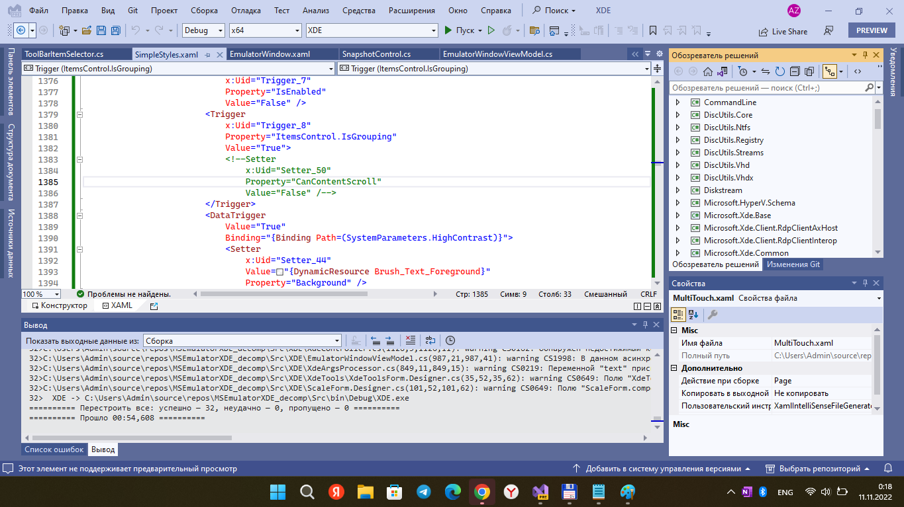

# Microsoft Emulator (XDE) dotnet Decompiled
My fork of MS Emulator (decompiled by Empyreal96).

## About
This is the source codes for parts of the Microsoft Emulator (aka XDE).
XDE used to run the Windows 10 Mobile Emulator Images.

## Screenshots
<p align="center">
    
   
</p>


## Tech. details

```
.NET Framworks
Decomp: 4.0-4.6--4.7.2
Changed to: 4.8

Common libs:
Newtonsoft.Json 12.0
System.Threading.Tasks.Dataflow (?)
System.Management.Automation (?)
Microsoft.Diagnostics.Tracing.EventSource (?)


**Original AppxPackage:** `Microsoft.MicrosoftEmulator_1.1.1081.0_x64__8wekyb3d8bbwe`

## My 2 cents
- 30 projects merged on main "XDE" solution.
- Some fast RnD completed (see Docs folder). 

## Status / progress of R.E.

(XDE)
XDE +-
Microsoft.Xde.Base  +-
Microsoft.Xde.Client.RdpClientAxHost  +-
Microsoft.Xde.Client.RdpClientInterop  +-
Microsoft.Xde.Communication  +
Microsoft.Xde.LocSimulator  +
Microsoft.Xde.SantPlugin +
Microsoft.Xde.Interface -/NA (fake repo temporary added)
Windows.Foundation.UniversalApiContract -/NA (fake repo temporary added)
Windows.Foundation.FoundationContract  -/NA (fake repo temporary added)
Windows.Services.Store.StoreContract  -/NA (fake repo temporary added)


(XdeConfig)
XdeConfig  +-
CommandLine +


(XdeManager)
XdeManager +-
DiscUtils.Core +
DiscUtils.Ntfs +-
DiscUtils.Registry +-
DiscUtils.Streams +
DiscUtils.Vhd +-
DiscUtils.Vhdx +-
Diskstream +-

Microsoft.HyperV.Schema +
Microsoft.Xde.Common +
Microsoft.Xde.Common.Base +
Microsoft.Xde.DeviceManagement
Microsoft.Xde.Hcs +-
Microsoft.Xde.Interface.Common +
Microsoft.Xde.Interface.Public.10.1 +
Microsoft.Xde.WindowsAPICodePack +
Microsoft.Xde.Wmi +-
WindowsDevicePortalWrapper +
```


## TODO
- Expect fixes needing to be applied to parts of the decompiled code, 
also some sections may have errors. 
- Use `dnSpy` or some analougues to obtain the lost code (i.e., Microsoft.Xde.Interface, 
Windows.Foundation.UniversalApiContract, Windows.Foundation.FoundationContract, Windows.Services.Store.StoreContract).
- Learn more about [Friend assemblies](https://learn.microsoft.com/en-us/dotnet/standard/assembly/friend/)... 
or change "internals" to "publics" at "internal" repos. 

## CAUTION 
This project has success on compiling. BUT app logics are very unstable (no tests, no good work guarantees).

## References
- https://github.com/Empyreal96/MSEmulator-XDE_dotnet_decompiled :: XDE_decompiled
- https://github.com/Empyreal96/ ::  Great C# Developer/Researcher 
- https://microsoft.com Original ::  Developer of original XDE

## .. 
AS IS. No support. RnD only / DIY

## .
: MediaExplorer74 :

:: 2022, November ::

